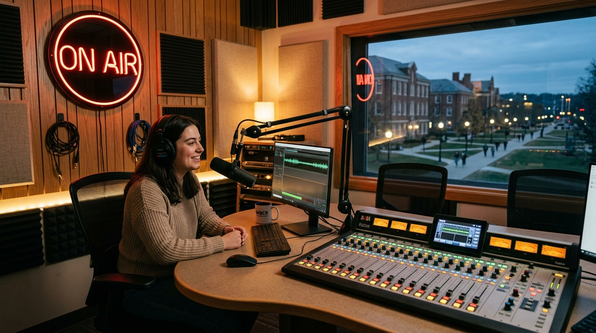

# 📻 Radyo A • 100.5 FM | Anadolu Üniversitesi Web Platformu

Anadolu Üniversitesi **İletişim Bilimleri Fakültesi** bünyesinde 1997 yılından bu yana yayın yapan Türkiye'nin köklü üniversite radyosu **Radyo A (100.5 FM)** için tasarlanmış özel, modern ve interaktif web platformu.



---

## 🌟 Öne Çıkan Özellikler

1. **Canlı Stüdyo & Master Konsol Oynatıcısı**:
   - **Canlı Üniversite Akışı**: Anadolu Üniversitesi Icecast akış bağlantısı (`http://canli.radyoa.anadolu.edu.tr:44445/Radyo_A_MP3`).
   - **Yedek Stüdyo Akış Desteği**: Üniversite kampüs güvenlik duvarı veya bağlantı kesintilerinde otomatik kesintisiz stüdyo alternatif akışı.
   - **Gerçek Zamanlı Spektrum Görselleştirici**: HTML5 Canvas tabanlı 48 bant dinamik frekans analizörü.
   - **Çift Analog VU Metre (Sol / Sağ Kanal)**: Vintage stüdyo konsolu ibreleriyle dinamik ses seviyesi ölçümü (-20dB / +3dB).
   - **Özel Web Audio Sentezleyici**: İstasyon jingle'ı (*"Dın-dın-dın! Radyo A 100.5 FM"*), stüdyo ON-AIR uyarı sesleri ve frekans parazit efektleri.

2. **İnteraktif Analog FM Radyo Ayarlayıcısı (FMTuner)**:
   - 88.0 – 108.0 MHz analog frekans kadranı.
   - Kadran kaydırılırken gerçekçi analog radyo hışırtısı (static noise) ve klik efektleri.
   - **100.5 MHz Radyo A** frekansına gelindiğinde manyetik kilitlenme, yeşil STEREO LED aktivasyonu ve otomatik jingle çalma.
   - TRT FM, Best FM, Kral FM gibi Eskişehir radyo istasyon işaretçileri ve tek tıkla kilitlenme butonu.

3. **Akıllı Canlı Yayın Akışı (Haftalık Program)**:
   - Güncel saat ve güne göre anlık olarak **"Şu An Yayında"** olan programı ve sıradaki programı otomatik tespit eden akıllı algoritma.
   - Pazartesi'den Pazar'a 7 günlük tam yayın akışı, kategori filtreleme (Müzik, Kültür-Sanat, Kampüs, Akademi, Spor).

4. **Haftanın Anadolu Top 10 Listesi**:
   - Öğrencilerin ve dinleyicilerin oylarıyla şekillenen haftalık liste.
   - Dinamik sıralama trendleri (▲, ▼, ▬, NEW) ve yerel depolama (LocalStorage) destekli interaktif oy verme sistemi.

5. **Podcast & Stüdyo Kayıt Arşivi**:
   - Özel stüdyo söyleşileri, teknopark başarıları, film festivalleri ve canlı akustik kayıtlarını doğrudan web oynatıcısından dinleme.

6. **Canlı Dinleyici İstek Hattı (Stüdyo Masası)**:
   - Dinleyicilerin anlık şarkı ve mesajlarını stüdyo mikserine ilettiği etkileşimli form.
   - Form gönderildiğinde otomatik DJ yanıtı ve canlı istek panosunda (Ticker) anında listelenme.

7. **Stüdyo Gece / Kampüs Gündüz Tema Desteği**:
   - Stüdyo atmosferini yansıtan karanlık obsidyen modu ve aydınlık kampüs modu arasında tek tıkla geçiş.

---

## 🚀 Hızlı Başlangıç

### Yöntem 1: Dahili Python Sunucusu ile Çalıştırma
```bash
python server.py
```
Sunucu başladığında tarayıcınızda otomatik olarak `http://localhost:3000` adresi açılacaktır.

### Yöntem 2: Node.js ile Çalıştırma
```bash
npx serve .
```

### Yöntem 3: Doğrudan Tarayıcıda Açma
`index.html` dosyasını doğrudan Chrome, Firefox veya Edge tarayıcınızda çift tıklayarak açabilirsiniz.

---

## 📂 Proje Yapısı

```
radyo-a/
├── index.html               # Ana sayfa ve tüm arayüz bileşenleri
├── server.py                # Geliştirme HTTP sunucusu (CORS ve MIME destekli)
├── README.md                # Proje dokümantasyonu
├── css/
│   └── style.css            # Stüdyo & kampüs temaları, VU metreler, FM dial ve animasyonlar
├── js/
│   ├── app.js               # Ana uygulama koordinatörü ve UI kontrolcüleri
│   ├── audio-player.js      # Canlı yayın, yedek akışlar ve Web Audio API motoru
│   ├── visualizer.js        # Canvas frekans spektrumu ve analog VU metre ibre animatörü
│   ├── tuner.js             # İnteraktif 88-108 MHz FM radyo kadranı
│   ├── schedule-data.js     # 7 günlük yayın akışı veritabanı ve saat hesaplayıcı
│   ├── request-system.js    # İstek hattı, stüdyo mesajları ve DJ yanıt sistemi
│   └── audio-clips.js       # Web Audio API ile parazit, klik ve jingle sentezleyicisi
└── assets/
    └── images/
        ├── logo.jpg         # Radyo A 100.5 FM özel logo amblemi
        └── studio.jpg       # Radyo A yayın stüdyosu görseli
```

---

## 📻 Radyo A Künyesi
- **Kurum:** Anadolu Üniversitesi İletişim Bilimleri Fakültesi
- **Yerleşke:** Yunus Emre Kampüsü, 26470 Tepebaşı / Eskişehir
- **Karasal Frekans:** 100.5 MHz FM (Eskişehir ve çevresi)
- **Kuruluş:** 1997
